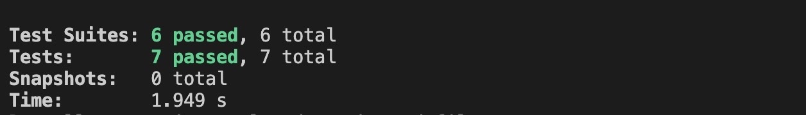
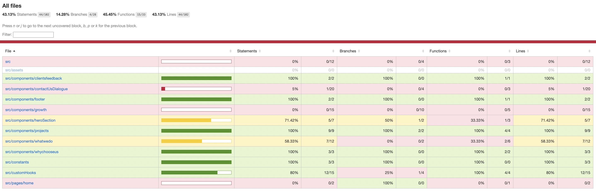

# Project Structure

- **build**: Contains all the build files for the React app.
- **public**: Contains the public directory provided out-of-the-box by create-react-app.
- **src**: Contains the source code of the React app.
  - **\_tests\_**: Contains all unit tests.
  - **assets**: Contains assets required for the app.
  - **components**: Contains all the components for the app.
    - **clientsfeedback**: Responsible for displaying Client's feedback section.
    - **contactUsDialogue**: Responsible for displaying contact-us pop-up.
    - **footer**: Responsible for displaying the footer.
    - **growth**: Contains UI component for displaying the growth.
    - **heroSection**: Contains UI component for Hero Section.
    - **projects**: Contains UI components for showing the projects.
    - **whatwedo**: Contains UI component for displaying what we do section.
    - **whychooseus**: Contains UI component for why choose us section.
  - **constants**: Contains the constants content to render in the sections.
  - **customHooks**: Contains all the custom hooks.
  - **pages**: Contains components rendering a page.
  - **App.tsx**: Contains the routes for the React app.
  - **index.css**: The general global CSS file.
  - **index.tsx**: The index file for the React app provided out-of-the-box by create-react-app.
  - **react-app-env.d.ts**: TypeScript module file provided out-of-the-box by create-react-app.
  - **reportWebVitals.ts**: Provided out-of-the-box by create-react-app.
  - **setupTests.ts**: For setting up tests using RTL and Jest.
- **tsconfig.json**: TypeScript configuration file.

# Hosted Link

[https://shrabanag.github.io/fyle/](https://shrabanag.github.io/fyle/)

# TEST Report

# COVERAGE Report

